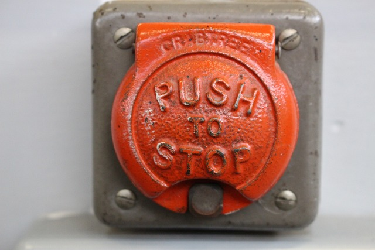
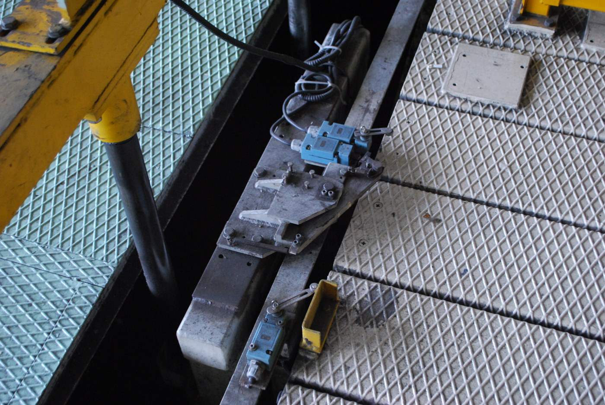
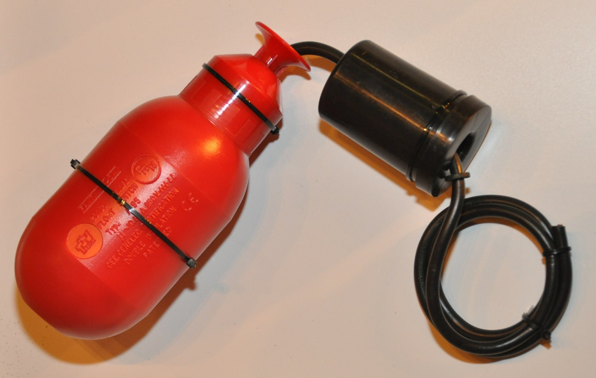
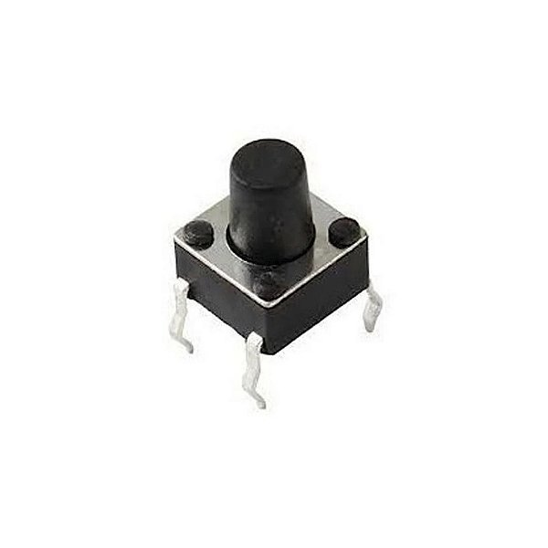
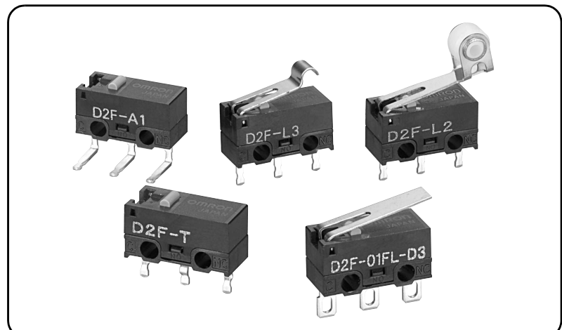
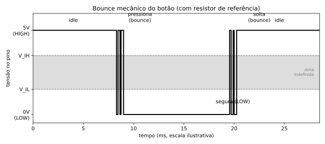
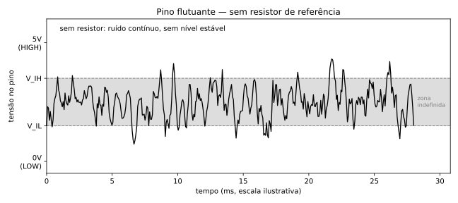
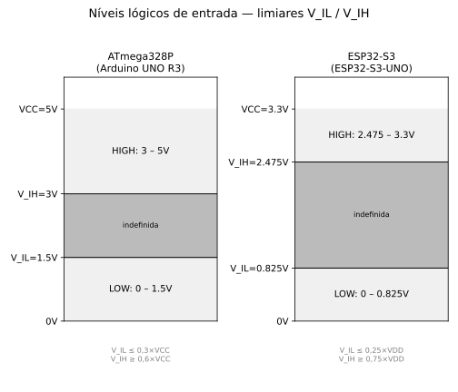
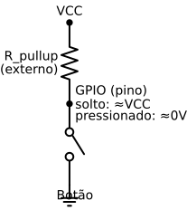
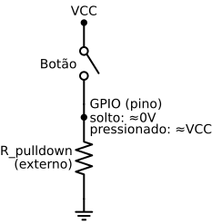

<!-- _class: lead -->

# Do Botão ao GPIO
## Lendo Entradas Digitais

S086 — Sistemas Microprocessados

<!--
Capa. Segue direto o Deck 1 (Saída). Mesmas placas de referência: Arduino
UNO R3 (ATmega328P, 5V) e ESP32-S3-UNO (ESP32-S3, 3,3V), lado a lado.
-->

---

## 🎯 Objetivo da aula

- Entender por que um botão sozinho **não basta**
- Ver o ruído que isso causa
- Ler um botão de forma confiável nas duas placas

---

### 🔴 Uma botoeira aciona a partida de um motor



<!--
Frame 1/3 — contexto industrial, abertura. Foto: Pixabay (licença livre)
— botoeira industrial de verdade (o exemplar fotografado é "PUSH TO
STOP", não "START" — mesmo estilo de botoeira, usado aqui só como
moldura visual, sem pretensão de ser o botão exato da frase).
-->

---

### 🚪 Um sensor de fim de curso detecta que uma porta está fechada



<!--
Frame 2/3. Foto: Wikimedia Commons, "Limit_Switches.JPG" (Mixabest),
CC BY-SA 3.0 —
https://commons.wikimedia.org/wiki/File:Limit_Switches.JPG — sensores de
fim de curso (caixas azuis) instalados em trilho de máquina industrial.
-->

---

### 🌊 Uma chave-boia informa o nível de um reservatório

**Para entender sistemas maiores, vamos começar pelo menor sensor
possível: um botão.**



<!--
Frame 3/3 — transição para a aula. Mesma lógica elétrica (um contato
informa um estado), em escala de bancada. Foto: Wikimedia Commons,
"Float switch for open tanks.JPG" (S.J. de Waard), CC BY 2.5 —
https://commons.wikimedia.org/wiki/File:Float_switch_for_open_tanks.JPG
-->

---

## 🔌 De volta à interface elétrica do GPIO

Hoje o pino passa a **ler** uma tensão que vem de fora, em vez de
impô-la.

**Mesma fronteira, sentido contrário.**


<!--
Retomada do diagrama 14, visto na aula de saída (slide 7 daquele deck).
Slide único, sem quebra em frames — é revisão, não introdução.
-->

---

## 🔋 Circuito básico: fonte + resistor + botão

Sem microcontrolador ainda — só pra observar a tensão em um ponto do
circuito ao apertar/soltar.


<!--
Diagrama 8. Espelha o circuito básico de LED do Deck Saída (slide 12
daquele deck).
-->

---

<!-- _class: pausa-previsao -->

## 🔮 Pausa — Previsão

O botão **fecha** o circuito ou **abre** o circuito quando está solto
(sem ninguém tocando)?

Será que todo botão funciona igual?

---

## 🔀 NA vs. NF: os dois tipos de contato

- **NA** (normalmente aberto / *Normally Open*): repouso = aberto, sem
  corrente. Pressionar **fecha** o circuito. A maioria dos botões usados
  com GPIO é NA.
- **NF** (normalmente fechado / *Normally Closed*): repouso = fechado,
  conduzindo. Pressionar **abre** o circuito.

**NA e NF não são "melhor" e "pior" — são escolhas de projeto:** cada um
define qual estado elétrico existe quando ninguém está acionando o
dispositivo.


<!--
Diagrama 15. No NF, o estado de repouso já conduz corrente pelo resistor
de referência (relevante em projetos sensíveis a consumo, ex. bateria);
em compensação, é justamente por já estar "fechado por padrão" que o NF
costuma aparecer em circuitos de segurança/fail-safe, onde um fio
rompido já é detectado como acionamento — como o sensor de fim de curso
do slide 4. Detalhamento de consumo/fail-safe fica para o guia.
-->

---

### 🔘 Botão de verdade — o que você já usou

**Tactile pushbutton** de 4 pinos (o do kit) — quase sempre NA.



<!--
Frame 1/2. Foto: catálogo Eletrogate.com.br ("Push Button (Chave Táctil)
6x6x7mm") — foto comercial de fornecedor, não licença aberta; uso
educacional/ilustrativo em material de aula, com fonte citada aqui
(diferente das fotos Pixabay/Commons usadas em outros slides, que têm
licença livre explícita — ver scripts/diagramas/README.md).
-->

---

### 🔘 Chave de verdade — COM/NO/NC no mesmo componente

**Microchave Omron D2F** — uma única chave mecânica pode oferecer os
dois contatos ao mesmo tempo (você escolhe qual fiar), diferente do
pushbutton do frame anterior, que só tem NA.



<!--
Frame 2/2. Foto: capa do datasheet Omron D2F (página 1), mostrando as
variantes D2F-A1/L3/L2/T/01FL-D3 —
datasheets/botoes/Omron_D2F_Microswitch_NA-NF.pdf.
-->

---

<!-- _class: pausa-previsao -->

## 🔮 Pausa — Previsão

Sem nenhum resistor conectado, o que a tensão faz no ponto entre o botão
e o fio, quando ninguém está tocando?

**Desenhem um palpite** do gráfico tensão × tempo.

<!--
Comparamos com os dados reais nos próximos dois slides.
-->

---

## 📈 Forma de onda: o que a tensão faz ao pressionar/soltar

Nível parado (idle) → transição ao pressionar → pequenas "quicadas"
(*bounce*, ruído mecânico do contato) antes de estabilizar → o mesmo ao
soltar.



<!--
Diagrama 9. Exemplo usa um botão NA, o caso padrão.
-->

---

## 📉 E sem nenhum resistor de referência?

Mesmo tipo de gráfico, mas agora o ponto fica "flutuando": **ruído
aleatório contínuo**, não só nas transições.



<!--
Diagrama 10. Antecipa o problema antes de falar em GPIO.
-->

---

## 🔌 O que é um GPIO

Pino de **propósito geral**, configurável como `INPUT` ou `OUTPUT` via
`pinMode()`.

---

## ⚡ O que é um nível lógico

**HIGH** e **LOW** são uma interpretação digital de uma faixa de tensão
— quem decide é o **circuito de entrada do chip**.

---

## 📏 Limiares dependem da tensão de operação e da tecnologia

- Faixa que garante **LOW** (V_IL máx.)
- Faixa que garante **HIGH** (V_IH mín.)
- Uma **zona indefinida** no meio

**É essa zona que o ruído do slide 14 fica cruzando.**

---

<!-- _class: pausa-garimpo -->

## 🔍 Pausa — Garimpo no datasheet

Abram `datasheets/ESP32-S3_Datasheet_v2.2_Espressif.pdf` e achem, na
tabela de características DC, o valor de **V_IH mínimo** (tensão de
entrada garantida como HIGH).

Anotem o valor e como ele se relaciona com VDD (~2 min).

---

## 📊 Na prática: ATmega328P (5V) vs. ESP32-S3 (3,3V)



<!--
Diagrama 13. Valores calculados a partir das frações especificadas no
datasheet de cada chip. Confirmar sempre contra a edição exata do
datasheet usada no guia (é o número que o garimpo do slide anterior deve
encontrar, do lado do ESP32-S3).
-->

---

<!-- _class: alerta -->

## ⚠️ Alerta rápido

**Não ligar uma saída de 5V direto em um pino de entrada 3,3V-only.**

Ultrapassa o V_IH **e também** o limite absoluto de tensão do pino — no
ESP32-S3, esse limite é **VDD+0,3V** para os pinos do domínio padrão de
3,3V (**3,6V** com VDD=3,3V).

Não é risco só teórico: **5V está bem acima desse teto.**

<!--
Alguns pinos especiais do chip operam em outro domínio de tensão (ex.
IO47/IO48, usados em configurações de flash/PSRAM octal, a 1,8V) — não
generalizar sem checar o datasheet. Colocado logo aqui porque é
exatamente o diagrama 13 (slide anterior) que torna essa diferença de
domínio de tensão visualmente explícita.
-->

---

## 🔀 E se os níveis de tensão forem diferentes?

Quando um sensor/módulo 5V precisa conversar com um GPIO 3,3V-only (ou
vice-versa), existem circuitos de **adaptação de nível** (*level
shifting*).

**Fica só o mapa mental de que a solução existe** — as técnicas
específicas (divisor resistivo, level-shifter dedicado, etc.) ficam para
outra aula/o guia técnico.

---

## 🔘 O mesmo botão, agora num GPIO

Trocamos a fonte genérica do slide 7 pelo pino do microcontrolador.

**A pergunta agora é:** o pino consegue decidir HIGH ou LOW com
confiança?

---

## ⚠️ O problema: entrada flutuante no GPIO

Sem pull-up/pull-down, o pino passa a maior parte do tempo na **zona
indefinida**.


<!--
Diagrama 10, reconectando com o gráfico do slide 14.
-->

---

<!-- _class: pausa-previsao -->

## 🔮 Pausa — Previsão/Proposta

Com o que já sabemos sobre resistores (das aulas de LED): **como vocês
resolveriam** o problema da entrada flutuante?

Proponham uma solução antes de eu mostrar as duas oficiais.

---

## ⬆️ Solução 1: Pull-up → entrada ativo-baixa

Resistor entre VCC e o pino; o botão (NA) **aterra** o pino ao ser
pressionado.

Repouso = HIGH, pressionado = LOW.



**Pull-up *é*, por construção, uma entrada ativo-baixa.**

<!--
Diagrama 11.
-->

---

## 💻 Pull-up interno

`pinMode(pino, INPUT_PULLUP)` — dispensa resistor externo, continua
sendo ativo-baixa.

<div class="columns">
<div>

### Arduino UNO R3

```cpp
const int BUTTON_PIN = 2;

void setup() {
  pinMode(BUTTON_PIN, INPUT_PULLUP);
}
```

</div>
<div>

### ESP32-S3-UNO

```cpp
const int BUTTON_PIN = D2;

void setup() {
  pinMode(BUTTON_PIN, INPUT_PULLUP);
}
```

</div>
</div>

---

## ⬇️ Solução 2: Pull-down → entrada ativo-alta

Resistor entre GND e o pino; o botão (NA) leva o pino ao **VCC** ao ser
pressionado.

Repouso = LOW, pressionado = HIGH.



**Pull-down *é*, por construção, uma entrada ativo-alta.**

<!--
Diagrama 12.
-->

---

## ⚖️ Ativo-alto vs. ativo-baixo — tabela-resumo

| | Repouso | Pressionado | Ativo |
|---|---|---|---|
| **Pull-up** | HIGH | LOW | ativo-**baixo** |
| **Pull-down** | LOW | HIGH | ativo-**alto** |

**Paralelo com a aula de saída:** GPIO fonte de corrente ↔ ativo-alto,
GPIO sumidouro de corrente ↔ ativo-baixo — a mesma simetria elétrica nos
dois sentidos.

<!--
Nota: com um botão NF a lógica de repouso/pressionado se inverte —
reforça por que "ativo-alto/baixo" depende da fiação e do tipo de
contato, não é uma propriedade fixa do botão.
-->

---

<!-- _class: pausa-previsao -->

## 🔮 Pausa — Previsão

Com `INPUT_PULLUP`, o que o Monitor Serial vai mostrar quando o botão
estiver **solto**? E quando **pressionado**?

Prevejam antes de rodar o código.

---

## 💻 Código completo

<div class="columns">
<div>

### Arduino UNO R3

```cpp
const int BUTTON_PIN = 2;

void setup() {
  Serial.begin(115200);
  pinMode(BUTTON_PIN, INPUT_PULLUP);
}

void loop() {
  int estado = digitalRead(BUTTON_PIN);
  Serial.println(
    estado == LOW ? "Pressionado" : "Solto");
  delay(100);
}
```

</div>
<div>

### ESP32-S3-UNO

```cpp
const int BUTTON_PIN = D2;

void setup() {
  Serial.begin(115200);
  pinMode(BUTTON_PIN, INPUT_PULLUP);
}

void loop() {
  int estado = digitalRead(BUTTON_PIN);
  Serial.println(
    estado == LOW ? "Pressionado" : "Solto");
  delay(100);
}
```

</div>
</div>

---

## 📈 Bounce revisitado: como lidar com ele

O pull-up/pull-down resolve o **flutuante**, mas **não elimina o
bounce** nas transições (visto no slide 13, diagrama 9).

Solução (*debounce* por software/hardware) fica para outra aula — a
título de gancho, a técnica mais simples: **ler, esperar ~50ms, ler de
novo.**

<!--
Referência: livros/esp8266_nodemcu_-_do_pisca_led_a_internet_das_coisas.md
traz essa técnica mostrada em código.
-->

---

## ✅ Checklist de revisão

- Nível lógico e seus limiares
- NA vs. NF
- Flutuante vs. pull-up vs. pull-down
- Ativo-alto vs. ativo-baixo
- Pull-up interno vs. externo
- Bounce
- Adaptação de nível 3,3V ↔ 5V

---

<!-- _class: lead -->

## 👋 Encerramento

<!--
Fecha o par de aulas de GPIO (saída + entrada) — mesma fronteira
elétrica, dois sentidos.
-->
