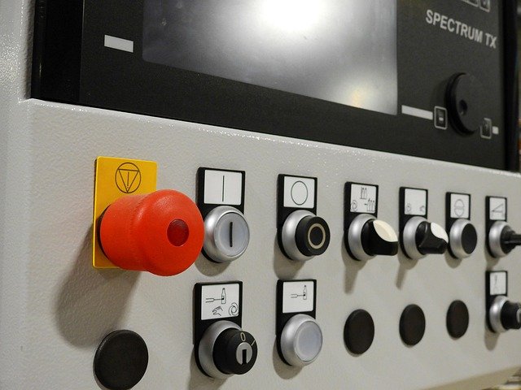
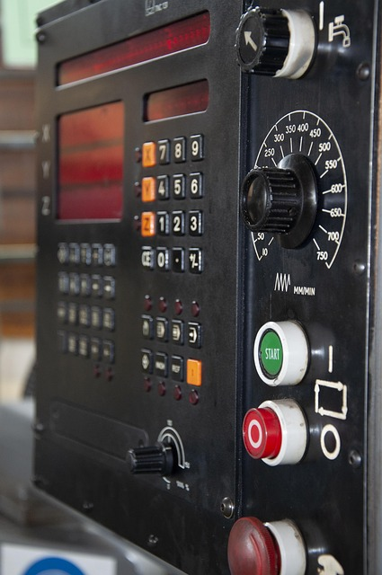
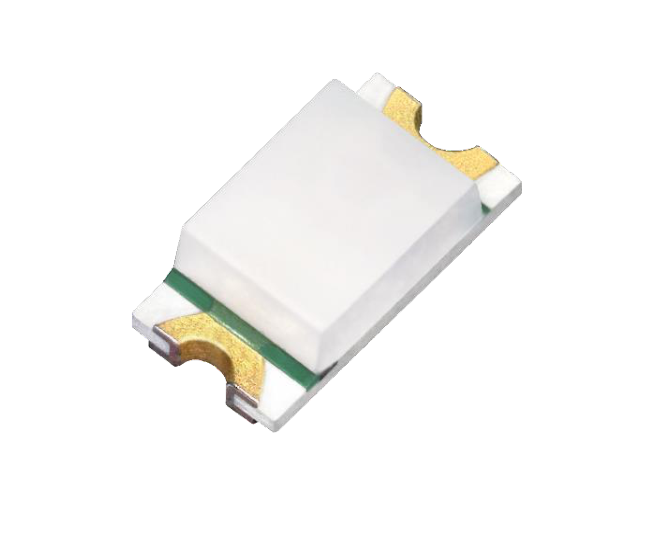
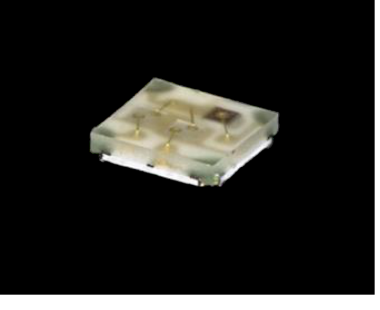

<!-- _class: lead -->

# Do LED ao GPIO
## Acionando Saídas Digitais

S086 — Sistemas Microprocessados

<!--
Capa. Placas de referência da aula inteira: Arduino UNO R3 (ATmega328P,
5V) e ESP32-S3-UNO (ESP32-S3, 3,3V), lado a lado em todos os exemplos.
-->

---

## 🎯 Objetivo da aula

- Calcular o resistor certo para acender um LED com segurança
- Entender como um GPIO — e, quando necessário, um transistor — assume o
  papel de fonte desse circuito

<!--
Duas competências: uma de eletrônica básica (dimensionar resistor) e uma
de interface com o microcontrolador (GPIO como fonte de tensão limitada).
-->

---

### 🏭 Um CLP aciona uma lâmpada de sinalização



<!--
Frame 1/3 — contexto industrial, abertura. Frase + imagem, sem mais
explicação ainda — a ideia é só ambientar. Foto: Pixabay (licença livre
para uso comercial/educacional, sem atribuição obrigatória) — painel de
máquina com botão luminoso, usado aqui como metáfora visual de
sinalização industrial.
-->

---

### ⚙️ Um controlador liga um contator


<!--
Frame 2/3. Foto: Pixabay — chão de fábrica/automação industrial.
-->

---

### 🤖 Um módulo eletrônico informa que uma máquina está em operação

**Para entender sistemas maiores, vamos começar pelo menor atuador
possível: um LED.**



<!--
Frame 3/3 — transição para a aula. Mesma lógica elétrica (um sinal de
controle aciona uma carga), só que em escala de bancada.
-->

---

### 🤔 Mas por trás de acender esse LED, algo mais fundamental

O microcontrolador vai **pôr uma tensão no mundo físico**, através de um
único pino.

<!--
Frame 1/2. Ainda sem diagrama — só a ideia em palavras, para o diagrama
do próximo slide "aterrissar" com mais efeito.
-->

---

### 🔌 Esse pino se chama GPIO

**GPIO = interface elétrica entre o microcontrolador e o mundo.**

Hoje vemos o sentido *saída*; na próxima aula, o sentido *entrada* (ler
uma tensão que vem de fora).


<!--
Frame 2/2 — revela o diagrama completo (diagrama 14). Esta é a tese que
conecta os dois decks (saída e entrada): mesma fronteira elétrica, dois
sentidos, não duas APIs desconectadas.
-->

---

## 💡 Como um LED acende

É um **diodo**: a corrente cresce fortemente conforme a tensão direta
aumenta.

A tensão de operação **V_F** depende da corrente e do dispositivo — não é
um limiar rígido de "liga/desliga".

Por isso usamos um resistor: **para controlar a corrente**, não para
"ligar" o LED.

<!--
Característica I-V extremamente não linear do diodo, mencionada
informalmente aqui — retomada no slide 18 para explicar por que não dá
para ligar o LED direto numa fonte de V_F volts.
-->

---

### 💡 LED de verdade — o clássico

**LED de 5mm (THT)** — o que a maioria já viu ou usou.

<!-- TODO: foto real pendente — LED THT 5mm genérico. Busca em bancos de
imagem livres (Pixabay, Wikimedia Commons) não achou um close-up de
qualidade; melhor resolver com foto própria de uma peça do kit em mãos. -->

<!--
Frame 1/3.
-->

---

### 💡 LED de verdade — em miniatura

**Chip SMD ROHM SML-D12** (1,6×0,8mm) — o mesmo símbolo triangular do
diagrama representa isso, só que do tamanho de um grão de arroz.



<!--
Frame 2/3. Foto: capa do datasheet ROHM SML-D12U8W (página 1),
datasheets/leds/ROHM_SML-D12U8W_Vermelho.pdf — extraída via PyMuPDF.
-->

---

### 💡 LED de verdade — três em um

**LED RGB**, 3 chips num só encapsulamento — adiantando o que vem no
slide 31.



<!--
Frame 3/3. Foto: capa do datasheet ROHM SMLP34RGBN1W (página 1, seção
"Outline"), datasheets/leds/ROHM_SMLP34RGBN1W_RGB.pdf.
-->

---

## 🔋 Circuito básico: fonte + resistor + LED

Sem microcontrolador ainda — só uma fonte de tensão qualquer
(pilha/fonte de bancada).


<!--
Diagrama 1. R e o LED ficam sem valor numérico de propósito — o cálculo
só entra a partir do slide 18.
-->

---

<!-- _class: pausa-previsao -->

## 🔮 Pausa — Previsão

**Chutem:** qual é a tensão direta (V_F) de um LED vermelho comum?

Anotem o palpite — comparamos com o dado real nos próximos slides.

<!--
Pausa ativa tipo previsão. Não revelar nada ainda.
-->

---

<!-- _class: revelacao -->

### 🔴 V_F — vermelho

**ROHM SML-D12U8W** (@ I_F = 20mA): **V_F típico = 2,2V**

<!--
Frame 1/4. Fonte: datasheets/leds/ROHM_SML-D12U8W_Vermelho.pdf, página 1.
Discussão oral aqui: "quem chutou perto de 2,2V?" — sem imprimir
"Resposta:" na tela.
-->

---

### 🟠 V_F — laranja

**ROHM SML-D12D8W** (mesma condição, I_F = 20mA): **V_F típico = 2,2V**

Igual ao vermelho — coincidência?

<!--
Frame 2/4.
-->

---

### 🟡 V_F — amarelo

**ROHM SML-D12Y8W** (I_F = 20mA): **V_F típico = 2,2V**

De novo?

<!--
Frame 3/4.
-->

---

### 🟢 V_F — verde, e a virada

**ROHM SML-D12P8W** (I_F = 20mA): **V_F típico = 2,2V**

As quatro cores desta família batem exatamente em 2,2V — o que muda entre
elas é o comprimento de onda (λD) e a intensidade luminosa (I_V), **não o
V_F**.

**V_F depende do componente e da corrente de teste — não é uma
propriedade fixa da cor.**

<!--
Frame 4/4. Fonte: datasheets/leds/ROHM_SML-D12*.pdf (as quatro cores).
Vira a virada pedagógica do bloco de revelação.
-->

---

## 📐 Calculando o resistor limitador

**R = (V_fonte − V_F) / I**

Exemplo: fonte genérica 9V, LED vermelho ROHM SML-D12U8W (V_F=2,2V
@20mA), I=10mA — o mesmo componente visto nos slides anteriores, não
"vermelho" em geral.

> "O resistor não limita a tensão do LED — limita a corrente."
> "A tensão que sobra depois do LED aparece no resistor" (V_R = V_fonte
> − V_F).

**Pergunta para a turma:** se o LED tem V_F=2,2V, por que não uso uma
fonte de 2,2V direto nele?

<!--
Resposta oral: V_F não é "a tensão que o LED precisa para funcionar", é a
tensão que aparece sobre ele quando uma certa corrente já está
circulando; sem elemento limitador, a corrente pode crescer para valores
destrutivos — é a característica I-V do diodo (slide 8), não um curto
literal.
-->

---

<!-- _class: pausa-calculo -->

## 🧮 Pausa — Cálculo

Com a fórmula do slide anterior: qual o resistor para o **LED verde ROHM
SML-D12P8W** (V_F=2,2V @20mA — o mesmo componente do slide 17, não
"verde" em geral) numa fonte de **9V**, com **I=15mA**?

Calculem antes de eu revelar.

<!--
Nota de produção — NÃO imprimir na tela: R=(9−2,2)/0,015≈453Ω →
comercial 470Ω. Revelar só verbalmente/em discussão ("quem chegou perto
de 470Ω?"), sem rótulo "Resposta:" na tela.
-->

---

## 🔌 O que muda quando a fonte é um GPIO?

O pino **não é uma fonte ideal**: tem um nível de tensão fixo e limitado
(5V no UNO, 3,3V no ESP32-S3-UNO) e uma capacidade de corrente limitada.

<!--
Ponte para a próxima ideia — ativo-alto/ativo-baixo.
-->

---

<!-- _class: pausa-previsao -->

## 🔮 Pausa — Previsão

Se eu quiser que o LED **apague** quando o GPIO estiver em **HIGH** (em
vez de acender), o que precisa mudar no circuito?

Pensem antes da explicação.

---

## ⚡ GPIO como fonte ou sumidouro de corrente

- GPIO em **HIGH** **fornece** corrente (*source*): alimenta o LED
  diretamente → circuito **ativo-alto**
- GPIO em **LOW** **absorve** corrente (*sink*): completa o caminho de um
  LED alimentado pelo VCC → circuito **ativo-baixo**

**A origem do ativo-alto/ativo-baixo é elétrica, não uma escolha
arbitrária de fiação.**

---

## ⬆️ Ativo-alto

Ânodo no GPIO, cátodo → resistor → GND. **HIGH acende.**


<!--
Diagrama 2.
-->

---

## ⬇️ Ativo-baixo

Cátodo no GPIO, ânodo → resistor → VCC. **LOW acende.**


Por que isso existe na prática: alguns módulos/placas vêm cabeados assim
de fábrica (ex.: LED onboard) — importante **ler o esquemático**, não
assumir.

<!--
Diagrama 3.
-->

---

<!-- _class: pausa-garimpo -->

## 🔍 Pausa — Garimpo no datasheet

Abram `datasheets/ATmega328P_Datasheet_Microchip.pdf` e achem, na seção
de características elétricas (**DC Characteristics**), o valor de
**corrente máxima absoluta por pino de I/O**.

Anotem o número e a página onde acharam (~2 min).

---

## ⚡ Limite de corrente por pino

Três categorias de número no datasheet, **não intercambiáveis**:

1. **Limite máximo absoluto** — o que acabaram de achar no garimpo (nunca
   pode ser ultrapassado, sob risco de dano ao chip)
2. **Condição de teste/especificação elétrica** — não é recomendação de
   uso contínuo
3. **Corrente de projeto recomendada** — bem mais conservadora que as
   duas anteriores

**Nunca dimensionar pelo limite absoluto nem confundi-lo com a condição
de teste.**

<!--
Tabela com os três números de cada chip (ATmega328P vs ESP32-S3), citando
datasheet e página/tabela exata, fica no guia técnico — não imprimir
número específico do ESP32-S3 aqui.
-->

---

## 📐 Exemplo de cálculo — UNO (5V)

LED vermelho (V_F=2,2V, ROHM SML-D12), I=10mA:

**R = (5 − 2,2) / 0,01 = 280Ω → valor comercial 330Ω**

*(fica levemente abaixo dos 10mA planejados — o que é seguro: errar para
menos corrente, nunca para mais)*

---

## 📐 Exemplo de cálculo — ESP32-S3 (3,3V)

Mesmo LED (V_F=2,2V), mesma corrente I=10mA:

**R = (3,3 − 2,2) / 0,01 = 110Ω → valor comercial 120Ω**

Mesmo LED, mesma corrente, **resistor menor** — só porque a fonte (o
pino) tem menos tensão sobrando para "queimar".

---

## 💻 Código

<div class="columns">
<div>

### Arduino UNO R3

```cpp
const int LED_PIN = 8;

void setup() {
  pinMode(LED_PIN, OUTPUT);
}

void loop() {
  digitalWrite(LED_PIN, HIGH);  // ativo-alto: acende
  delay(1000);
  digitalWrite(LED_PIN, LOW);
  delay(1000);
}
```

</div>
<div>

### ESP32-S3-UNO

```cpp
const int LED_PIN = D8;  // rótulo do header

void setup() {
  pinMode(LED_PIN, OUTPUT);
}

void loop() {
  digitalWrite(LED_PIN, HIGH);  // ativo-alto: acende
  delay(1000);
  digitalWrite(LED_PIN, LOW);
  delay(1000);
}
```

</div>
</div>

<!--
Para o circuito ativo-baixo, mesma lógica com HIGH/LOW invertidos no
digitalWrite. D8 = mesmo rótulo do header form-factor UNO; confirmar no
guia que a variant.h da placa usada define essa macro.
-->

---

<!-- _class: pausa-previsao -->

## 🔮 Pausa — Previsão

Um LED RGB tem 3 chips diferentes dentro do mesmo encapsulamento.

**Vocês acham que os 3 têm o mesmo V_F? Por quê?**

---

## 🌈 LED RGB: três LEDs, três V_F diferentes, um só encapsulamento

**ROHM SMLP34RGBN1W** (4 pinos, ânodo comum + 3 cátodos R/G/B), a
I_F=5mA:

| Cor | V_F típico |
|---|---|
| Vermelho | 1,9V |
| Verde | 2,9V |
| Azul | 3,0V |

**Cada canal de cor precisa do seu próprio cálculo de resistor** — mesma
fórmula do slide 18, aplicada 3 vezes.

<!--
É aqui que finalmente aparece um V_F real de LED azul, que não existe na
família SML-D12 de cor única. Fonte:
datasheets/leds/ROHM_SMLP34RGBN1W_RGB.pdf, página 1.
-->

---

## 📊 V_F não é um valor fixo — Min/Typ/Max

**Everlight 67-63-RGB0201H-AM** (RGB automotivo), a I_F=20mA:

| Cor | V_F mín/típ/máx | Faixa aceitável de I_F |
|---|---|---|
| Vermelho | 1,75 / 1,95 / 2,75V | 5–50mA |
| Verde | 2,75 / 3,10 / 3,75V | 3–30mA |
| Azul | 2,75 / 3,00 / 3,75V | 3–30mA |

**Pergunta para a turma:** se eu disser simplesmente "V_F=2V", estou
dizendo toda a verdade?

<!--
A resposta é o datasheet: um intervalo, não um ponto. Fonte:
datasheets/leds/Everlight_67-63-RGB0201H-AM_RGB_MinTypMax.pdf, página 3
("1. Characteristics").
-->

---

## ⚠️ Quando o GPIO não basta

Cargas que puxam mais corrente do que o pino aguenta: motor, relé, fita
de LED, lâmpada.

Voltando aos exemplos do início (o contator, a lâmpada de sinalização de
maior potência) — é exatamente aqui que essas cargas "de verdade"
entram.

**GPIO não alimenta a carga diretamente.**

---

## 🔀 Transistor como chave

O GPIO só **controla** (base/gate); quem alimenta a carga é uma **fonte
externa**.

Duas famílias (BJT / MOSFET) × duas topologias (low-side / high-side).

---

## 🔽 Chave low-side: NPN

GPIO HIGH liga a chave (precisa de corrente de base contínua),
conectando o lado "baixo" da carga ao GND; a fonte externa alimenta o
lado "alto" direto.


<!--
Frame 1/4. Diagrama 4.
-->

---

## 🔽 Chave low-side: MOSFET-N

Mesma topologia, mas comandada por **tensão** no gate (não corrente
contínua) + resistor de **pull-down** para garantir que fique desligada
quando o GPIO estiver em estado indefinido/flutuante.


<!--
Frame 2/4. Diagrama 5.
-->

---

## 🔼 Chave high-side: PNP

Lógica **invertida** (GPIO LOW liga a chave); fica entre a fonte externa
e o lado "alto" da carga.


<!--
Frame 3/4. Diagrama 6.
-->

---

## 🔼 Chave high-side: MOSFET-P

Mesma lógica invertida, comandada por tensão; resistor de **pull-up** ao
VCC no gate garante que fique desligada em estado indefinido/flutuante
(ex.: durante o boot) — mesma função de segurança que o pull-down cumpre
no MOSFET-N.


<!--
Frame 4/4. Diagrama 7.
-->

---

## ⚖️ Comparativo rápido

| | Acionamento | Lógica |
|---|---|---|
| **BJT** | corrente de base | direta/invertida conforme topologia |
| **MOSFET** | tensão de gate | direta/invertida conforme topologia |
| **Low-side** | — | direta (GPIO HIGH liga) |
| **High-side** | — | invertida (GPIO LOW liga) |

**Critério prático de escolha:** dois parâmetros do componente precisam
cobrir a carga — corrente máxima e tensão máxima entre
coletor/dreno–emissor/fonte.

<!--
Aviso: dimensionar resistor de base/gate e checar compatibilidade de
tensão fica para um estudo de caso à parte — aqui é só o mapa mental de
qual usar quando.
-->

---

## ✅ Checklist de revisão

- V_F como dado de datasheet (não valor fixo por cor) + fórmula do
  resistor
- Ativo-alto vs. ativo-baixo (fonte vs. sumidouro de corrente)
- Limite de corrente do pino (três categorias, não confundir)
- LED RGB: 3 cálculos independentes
- Quando/qual transistor usar

---

<!-- _class: lead -->

## 👋 Encerramento

Próxima aula: **a mesma fronteira elétrica, no sentido contrário** —
lendo uma tensão que vem de fora (botão).

<!--
Gancho direto para o Deck 2 (Entrada). Mesmo diagrama 14, retomado no
slide 6 daquele deck.
-->
